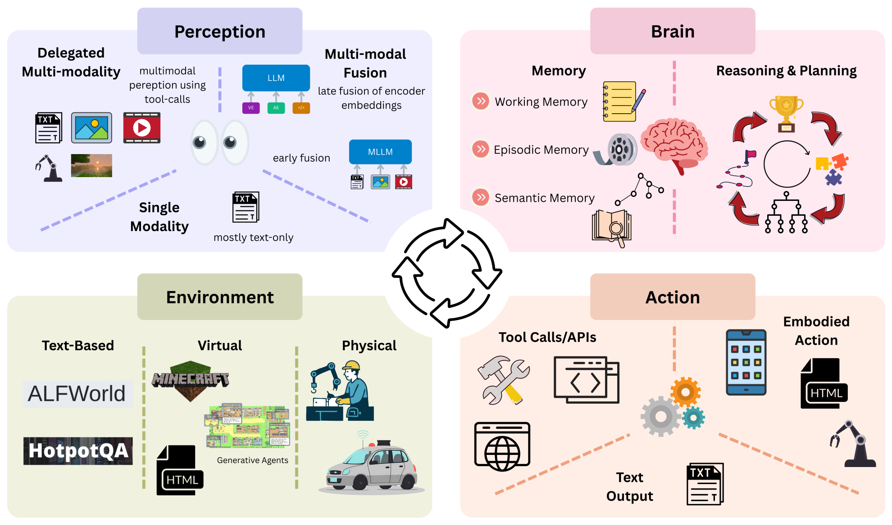
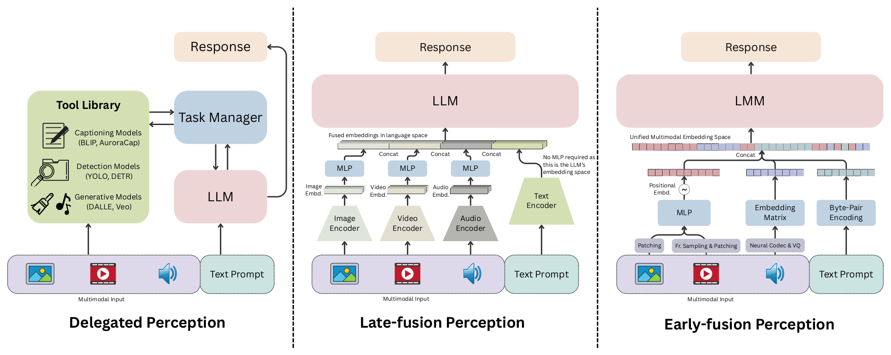
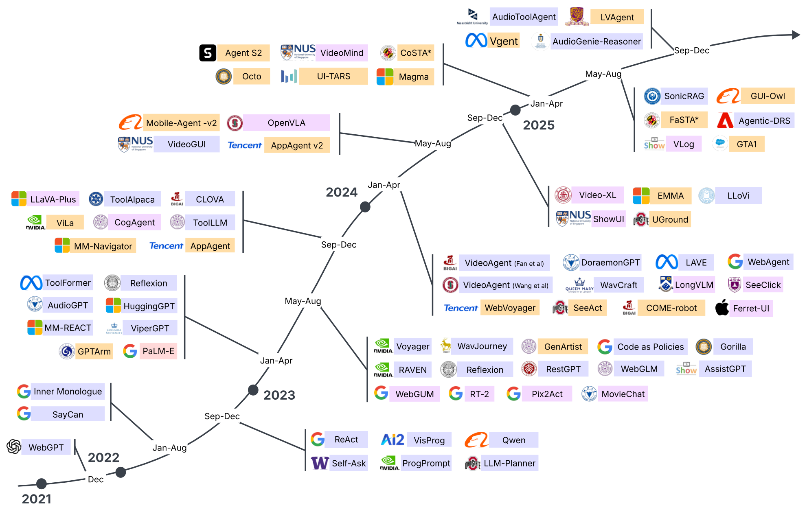
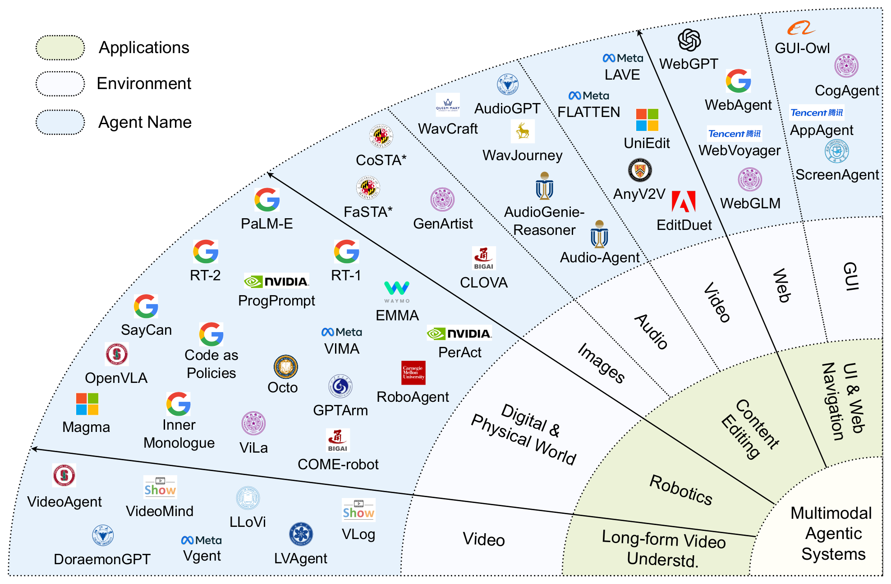

<div align="center">

# Awesome Multimodal Agentic Frameworks

<p>A curated, continuously updated collection of papers, code, benchmarks, and datasets for <b>multimodal agentic systems</b> — agents that perceive, reason, remember, plan, and act across images, video, audio, GUIs, and the physical world.</p>

[](https://openreview.net/forum?id=eaVoaI7f8v)
[](https://arxiv.org/abs/2608.20379)
[](https://awesome.re)
[](CONTRIBUTING.md)
[](LICENSE)
[](https://github.com/rishieraj/awesome-multimodal-agents/stargazers)

### A Survey on Foundations and Frontiers of Multimodal Agentic Frameworks: Techniques and Applications

Neel Mokaria<sup>\*,1</sup>, Rishie Raj<sup>\*,1</sup>, Dheeraj Baiju<sup>\*,2</sup>, Xiaoqian Shen<sup>3</sup>, Shraman Pramanick<sup>4</sup>,<br>
Kevin Qinghong Lin<sup>5</sup>, Arda Senocak<sup>6</sup>, Mike Zheng Shou<sup>7</sup>, Philip Torr<sup>5</sup>, Mohamed Elhoseiny<sup>3</sup>,<br>
Yapeng Tian<sup>8</sup>, Ruohan Gao<sup>1</sup>, Salman Khan<sup>9</sup>, Sayan Nag<sup>10</sup>, Sanjoy Chowdhury<sup>#,1</sup>, Dinesh Manocha<sup>1</sup>

<sup>1</sup>University of Maryland, College Park &nbsp;·&nbsp; <sup>2</sup>IISc Bangalore &nbsp;·&nbsp; <sup>3</sup>KAUST &nbsp;·&nbsp; <sup>4</sup>Johns Hopkins University &nbsp;·&nbsp; <sup>5</sup>University of Oxford<br>
<sup>6</sup>Ulsan National Institute of Science and Technology &nbsp;·&nbsp; <sup>7</sup>National University of Singapore &nbsp;·&nbsp; <sup>8</sup>University of Texas at Dallas<br>
<sup>9</sup>MBZUAI &nbsp;·&nbsp; <sup>10</sup>University of Toronto

<sup>\*</sup>Core contributors &nbsp;&nbsp; <sup>#</sup>Core advisor

📧 `{nmokaria, rraj27, sanjoyc}@umd.edu`, `dheerajbaiju@iisc.ac.in`

</div>

<p align="center">
  
</p>
<p align="center">
  <em><b>Overall agentic architecture.</b> The <b>Perception</b> module grounds raw multimodal input, the <b>Orchestrator</b> ("Brain") reasons, plans, and stores experience across working, episodic, and semantic memory, and the <b>Action</b> module interacts with text-based, virtual, or physical environments. Signal flow between the three forms the cognitive loop that enables agentic behavior.</em>
</p>

---

<a id="news"></a>
## 📢 News

* **Ongoing:** Actively accepting community contributions — see [CONTRIBUTING.md](CONTRIBUTING.md).
* **June 2026:** Repository launched.
* **May 2026:** Our survey paper was accepted at TMLR.

---

<a id="contents"></a>
## 📌 Contents

- [Overview](#overview)
- [What is a Multimodal Agent?](#definition)
- [Taxonomy](#taxonomy)
  - [1. Perception](#perception)
  - [2. Reasoning & Planning](#reasoning)
  - [3. Memory](#memory)
  - [4. Action](#action)
- [Evolution of Agentic Frameworks](#evolution)
- [Papers by Application Domain](#applications)
  - [Text-Only Foundations](#text-only)
  - [Robotics & Physical Embodiment](#robotics)
  - [GUI & Web Navigation](#gui)
  - [Multimedia Content Generation & Editing](#multimedia)
  - [Long-Form Video Understanding & Retrieval](#video)
- [Evaluation Methodologies](#evaluation)
- [Performance Comparison](#performance)
- [Efficiency, Scalability & Latency](#efficiency)
- [Open Challenges](#challenges)
- [Future Directions](#future)
- [Benchmarks](#benchmarks)
- [Datasets](#datasets)
- [Open-Source Projects](#projects)
- [Contributing](#contributing)
- [Citation](#citation)

---

<a id="overview"></a>
## 🔭 Overview

Recent advances in Large Language Models (LLMs) and Large Multimodal Models (LMMs) have enabled **agentic systems** capable of perceiving, reasoning, remembering, planning, and acting in complex environments.

Unlike traditional LLM agents that rely on textual abstractions, modern multimodal agents operate directly on images, video, audio, GUI screenshots, web interfaces, and physical environments. Our survey analyzes how multimodality reshapes each functional module of the agentic stack, and correlates architectural choices with measured performance, efficiency, and reliability.

This repository extends the survey into a **living resource** organizing research papers, open-source implementations, benchmarks, and datasets.

<a id="definition"></a>
## 🧠 What is a Multimodal Agent?

> A framework that uses a Large Multimodal Model (LMM) as its core backbone to **perceive, reason, remember, plan, and act across multiple modalities simultaneously**.

This stands in contrast to text-only agents, which convert every non-text input into language and suffer information loss in the process. A true multimodal agent natively ingests and reasons over rich multimodal representations to generate grounded plans, then orchestrates tools or actuators to act on digital or physical environments.

Modalities covered: **Text · Images · Video · Audio · GUI Screens · Web Interfaces · Sensor Streams · Physical Environments**

---

<a id="taxonomy"></a>
## 🗂️ Taxonomy

Our survey organizes multimodal agents around the cognitive loop:

```text
Perceive → Reason → Remember → Plan → Act
```

Each entry links to the corresponding paper. Framework names are shown after the title when the title alone is not sufficiently descriptive.

<a id="perception"></a>
### 1. Perception

<p align="center">
  
</p>
<p align="center">
  <em><b>Types of perception fusion.</b> <b>Delegated perception</b> uses tool calls to read each modality and convert it to natural language. <b>Late-fusion perception</b> projects modality-specific encoder features into the language embedding space. <b>Early-fusion perception</b> natively tokenizes raw multimodal input into a unified vocabulary.</em>
</p>

#### Delegated Perception (via Tool Calling)

Tool-calling systems use specialist models to translate non-text modalities into representations a language-model orchestrator can consume.

* [HuggingGPT: Solving AI Tasks with ChatGPT and its Friends in Hugging Face](https://arxiv.org/abs/2303.17580) (2023)
* [Visual ChatGPT: Talking, Drawing and Editing with Visual Foundation Models](https://arxiv.org/abs/2303.04671) (2023)
* [MM-REACT: Prompting ChatGPT for Multimodal Reasoning and Action](https://arxiv.org/abs/2303.11381) (2023)
* [Visual Programming: Compositional Visual Reasoning without Training](https://arxiv.org/abs/2211.11559) — VISPROG (2022)
* [ViperGPT: Visual Inference via Python Execution for Reasoning](https://arxiv.org/abs/2303.08128) (2023)
* [CLOVA: A Closed-Loop Visual Assistant with Tool Usage and Update](https://arxiv.org/abs/2312.10908) (2024)
* [Chameleon: Plug-and-Play Compositional Reasoning with Large Language Models](https://arxiv.org/abs/2304.09842) (2023)

#### Late-Fusion Perception

Modality-specific encoders and projectors map sensory inputs into a language-model embedding space.

* [Flamingo: a Visual Language Model for Few-Shot Learning](https://arxiv.org/abs/2204.14198) (2022)
* [Egocentric Video-Language Pretraining](https://arxiv.org/abs/2206.01670) — EgoVLP (2022)
* [EgoVLPv2: Egocentric Video-Language Pre-training with Fusion in the Backbone](https://arxiv.org/abs/2307.05463) (2023)
* [Visual Instruction Tuning](https://arxiv.org/abs/2304.08485) — LLaVA (2023)
* [LLaVA-Plus: Learning to Use Tools for Creating Multimodal Agents](https://arxiv.org/abs/2311.05437) (2024)
* [Magma: A Foundation Model for Multimodal AI Agents](https://arxiv.org/abs/2502.13130) (2025)
* [LongVLM: Efficient Long Video Understanding via Large Language Models](https://arxiv.org/abs/2404.03384) (2024)
* [Video-XL: Extra-Long Vision Language Model for Hour-Scale Video Understanding](https://arxiv.org/abs/2409.14485) (2024)
* [LongVU: Spatiotemporal Adaptive Compression for Long Video-Language Understanding](https://arxiv.org/abs/2410.17434) (2024)
* [MovieChat: From Dense Token to Sparse Memory for Long Video Understanding](https://arxiv.org/abs/2307.16449) (2024)
* [RT-2: Vision-Language-Action Models Transfer Web Knowledge to Robotic Control](https://arxiv.org/abs/2307.15818) (2023)
* [OpenVLA: An Open-Source Vision-Language-Action Model](https://arxiv.org/abs/2406.09246) (2024)
* [PaLM-E: An Embodied Multimodal Language Model](https://arxiv.org/abs/2303.03378) (2023)
* [From Pixels to UI Actions: Learning to Follow Instructions via Graphical User Interfaces](https://arxiv.org/abs/2306.00245) — Pix2Act (2023)
* [Multimodal Web Navigation with Instruction-Finetuned Foundation Models](https://arxiv.org/abs/2305.11854) — WebGUM (2023)
* [CogAgent: A Visual Language Model for GUI Agents](https://arxiv.org/abs/2312.08914) (2024)
* [Ferret-UI: Grounded Mobile UI Understanding with Multimodal LLMs](https://arxiv.org/abs/2404.05719) (2024)

#### Early-Fusion Perception

Unified architectures process multiple modalities natively in a shared model.

* [GPT-4o System Card](https://arxiv.org/abs/2410.21276) (2024)
* [Gemini 1.5: Unlocking Multimodal Understanding across Millions of Tokens of Context](https://arxiv.org/abs/2403.05530) (2024)
* [Chameleon: Mixed-Modal Early-Fusion Foundation Models](https://arxiv.org/abs/2405.09818) (2024)
* [Fuyu-8B](https://huggingface.co/adept/fuyu-8b) — model release; [announcement](https://www.adept.ai/blog/fuyu-8b) (2023)
* [LongVILA: Scaling Long-Context Visual Language Models for Long Videos](https://arxiv.org/abs/2408.10188) (2024)
* [Transfusion: Predict the Next Token and Diffuse Images with One Multi-Modal Model](https://arxiv.org/abs/2408.11039) (2024)
* [Show-o: One Single Transformer to Unify Multimodal Understanding and Generation](https://arxiv.org/abs/2408.12528) (2024)
* [Janus-Pro: Unified Multimodal Understanding and Generation with Data and Model Scaling](https://arxiv.org/abs/2501.17811) (2025)

<a id="reasoning"></a>
### 2. Reasoning & Planning

#### Language-Based Reasoning

* [Chain-of-Thought Prompting Elicits Reasoning in Large Language Models](https://arxiv.org/abs/2201.11903) (2022)
* [Tree of Thoughts: Deliberate Problem Solving with Large Language Models](https://arxiv.org/abs/2305.10601) (2023)
* [ReAct: Synergizing Reasoning and Acting in Language Models](https://arxiv.org/abs/2210.03629) (2022)
* [Reflexion: Language Agents with Verbal Reinforcement Learning](https://arxiv.org/abs/2303.11366) (2023)
* [Measuring and Narrowing the Compositionality Gap in Language Models](https://arxiv.org/abs/2210.03350) — Self-Ask (2022)
* [LLM-Planner: Few-Shot Grounded Planning for Embodied Agents with Large Language Models](https://arxiv.org/abs/2212.04088) (2023)

#### Visually Grounded Reasoning

* [GPT-4V(ision) is a Generalist Web Agent, if Grounded](https://arxiv.org/abs/2401.01614) — SeeAct (2024)
* [WebVoyager: Building an End-to-End Web Agent with Large Multimodal Models](https://arxiv.org/abs/2401.13919) (2024)
* [Magma: A Foundation Model for Multimodal AI Agents](https://arxiv.org/abs/2502.13130) (2025)
* [RT-2: Vision-Language-Action Models Transfer Web Knowledge to Robotic Control](https://arxiv.org/abs/2307.15818) (2023)
* [OpenVLA: An Open-Source Vision-Language-Action Model](https://arxiv.org/abs/2406.09246) (2024)
* [CoT-VLA: Visual Chain-of-Thought Reasoning for Vision-Language-Action Models](https://arxiv.org/abs/2503.22020) (2025)
* [HALO: A Unified Vision-Language-Action Model for Embodied Multimodal Chain-of-Thought Reasoning](https://arxiv.org/abs/2602.21157) (2026)
* [VideoAgent: Long-form Video Understanding with Large Language Model as Agent](https://arxiv.org/abs/2403.10517) (2024)

#### Cross-Modal Reasoning

* [ImageBind: One Embedding Space To Bind Them All](https://arxiv.org/abs/2305.05665) (2023)
* [PandaGPT: One Model To Instruction-Follow Them All](https://arxiv.org/abs/2305.16355) (2023)
* [NExT-GPT: Any-to-Any Multimodal LLM](https://arxiv.org/abs/2309.05519) (2024)
* [CoDi-2: In-Context, Interleaved, and Interactive Any-to-Any Generation](https://arxiv.org/abs/2311.18775) (2024)
* [ReelWave: Multi-Agentic Movie Sound Generation through Multimodal LLM Conversation](https://arxiv.org/abs/2503.07217) (2025)
* [AudioAgent: Enhancing Task Performance through Modality-Driven Prompt Optimization](https://openreview.net/forum?id=VLzLj7dU9b) (2024)

<a id="memory"></a>
### 3. Memory

Agents retain information across three cognitive timescales — **working memory** (active reasoning buffer), **episodic memory** (past experiences), and **semantic memory** (general world knowledge). How these are implemented depends on whether modalities are handled in isolation or through a unified representation.

#### Modality-Specific Memory

* [HuggingGPT: Solving AI Tasks with ChatGPT and its Friends in Hugging Face](https://arxiv.org/abs/2303.17580) (2023)
* [Visual ChatGPT: Talking, Drawing and Editing with Visual Foundation Models](https://arxiv.org/abs/2303.04671) (2023)
* [VideoAgent: Long-form Video Understanding with Large Language Model as Agent](https://arxiv.org/abs/2403.10517) (2024)

#### Unified Memory

* [Gemini 1.5: Unlocking Multimodal Understanding across Millions of Tokens of Context](https://arxiv.org/abs/2403.05530) (2024)
* [GPT-4o System Card](https://arxiv.org/abs/2410.21276) (2024)
* [HM-RAG: Hierarchical Multi-Agent Multimodal Retrieval Augmented Generation](https://arxiv.org/abs/2504.12330) (2025)
* [ImageBind: One Embedding Space To Bind Them All](https://arxiv.org/abs/2305.05665) (2023)
* [SonicRAG: High Fidelity Sound Effects Synthesis Based on Retrieval Augmented Generation](https://arxiv.org/abs/2505.03244) (2025)

#### Temporal Context Management

* [Mobile-Agent-v2: Mobile Device Operation Assistant with Effective Navigation via Multi-Agent Collaboration](https://arxiv.org/abs/2406.01014) (2024)
* [AppAgent v2: Advanced Agent for Flexible Mobile Interactions](https://arxiv.org/abs/2408.11824) (2024)
* [Reflexion: Language Agents with Verbal Reinforcement Learning](https://arxiv.org/abs/2303.11366) (2023)
* [Mobile-Agent-v3: Fundamental Agents for GUI Automation](https://arxiv.org/abs/2508.15144) — GUI-Owl (2025)

#### Bandwidth Management

* [VideoAgent: A Memory-augmented Multimodal Agent for Video Understanding](https://arxiv.org/abs/2403.11481) (2024)
* [A Simple LLM Framework for Long-Range Video Question-Answering](https://arxiv.org/abs/2312.17235) — LLoVi (2024)
* [DoraemonGPT: Toward Understanding Dynamic Scenes with Large Language Models](https://arxiv.org/abs/2401.08392) (2024)
* [VLog: Video-Language Models by Generative Retrieval of Narration Vocabulary](https://arxiv.org/abs/2503.09402) (2025)

<a id="action"></a>
### 4. Action

#### Language-Driven Actions

* [Toolformer: Language Models Can Teach Themselves to Use Tools](https://arxiv.org/abs/2302.04761) (2023)
* [Gorilla: Large Language Model Connected with Massive APIs](https://arxiv.org/abs/2305.15334) (2023)
* [MLLM-Tool: A Multimodal Large Language Model For Tool Agent Learning](https://arxiv.org/abs/2401.10727) (2024)
* [ToolLLM: Facilitating Large Language Models to Master 16000+ Real-world APIs](https://arxiv.org/abs/2307.16789) (2023)
* [ToolkenGPT: Augmenting Frozen Language Models with Massive Tools via Tool Embeddings](https://arxiv.org/abs/2305.11554) (2023)
* [RestGPT: Connecting Large Language Models with Real-World RESTful APIs](https://arxiv.org/abs/2306.06624) (2023)
* [ToolAlpaca: Generalized Tool Learning for Language Models with 3000 Simulated Cases](https://arxiv.org/abs/2306.05301) (2023)

#### Visually Grounded Actions

* [AppAgent: Multimodal Agents as Smartphone Users](https://arxiv.org/abs/2312.13771) (2023)
* [CogAgent: A Visual Language Model for GUI Agents](https://arxiv.org/abs/2312.08914) (2024)
* [WebVoyager: Building an End-to-End Web Agent with Large Multimodal Models](https://arxiv.org/abs/2401.13919) (2024)
* [Mobile-Agent: Autonomous Multi-Modal Mobile Device Agent with Visual Perception](https://arxiv.org/abs/2401.16158) (2024)
* [VoxPoser: Composable 3D Value Maps for Robotic Manipulation with Language Models](https://arxiv.org/abs/2307.05973) (2023)
* [Navigating the Digital World as Humans Do: Universal Visual Grounding for GUI Agents](https://arxiv.org/abs/2410.05243) — UGround (2024)

#### Embodied Multimodal Actions

* [Do As I Can, Not As I Say: Grounding Language in Robotic Affordances](https://arxiv.org/abs/2204.01691) — SayCan (2022)
* [RT-2: Vision-Language-Action Models Transfer Web Knowledge to Robotic Control](https://arxiv.org/abs/2307.15818) (2023)
* [OpenVLA: An Open-Source Vision-Language-Action Model](https://arxiv.org/abs/2406.09246) (2024)
* [PaLM-E: An Embodied Multimodal Language Model](https://arxiv.org/abs/2303.03378) (2023)
* [Octo: An Open-Source Generalist Robot Policy](https://arxiv.org/abs/2405.12213) (2024)
* [Perceiver-Actor: A Multi-Task Transformer for Robotic Manipulation](https://arxiv.org/abs/2209.05451) — PerAct (2022)

---
<a id="evolution"></a>
## 📅 Evolution of Agentic Frameworks

<p align="center">
  
</p>
<p align="center">
  <em><b>Evolution of agentic frameworks</b>, starting from WebGPT in late 2021. Frameworks are distinguished by the perception technique they use — <b>delegated</b>, <b>late-fusion</b>, and <b>early-fusion</b> — the same axis used throughout the survey to compare systems across application areas.</em>
</p>

---

<a id="applications"></a>
## 🚀 Papers by Application Domain

<p align="center">
  
</p>
<p align="center">
  <em><b>Domain classification</b> of representative agentic frameworks across the four primary application areas, further classified by the environments in which they operate. In robotics in particular, most frameworks have been evaluated in both virtual and real-world physical environments.</em>
</p>

<a id="text-only"></a>
### 💬 Text-Only Foundations

The language-only agents that established the reasoning, planning, and tool-orchestration patterns later inherited by multimodal systems.

#### Question Answering and Self-Correction

* [WebGPT: Browser-assisted question-answering with human feedback](https://arxiv.org/abs/2112.09332) (2021)
* [ReAct: Synergizing Reasoning and Acting in Language Models](https://arxiv.org/abs/2210.03629) (2022)
* [Reflexion: Language Agents with Verbal Reinforcement Learning](https://arxiv.org/abs/2303.11366) (2023)
* [Measuring and Narrowing the Compositionality Gap in Language Models](https://arxiv.org/abs/2210.03350) — Self-Ask (2022)

#### Multi-Agent Collaboration and Software Development

* [Evaluating Large Language Models Trained on Code](https://arxiv.org/abs/2107.03374) — Codex (2021)
* [MetaGPT: Meta Programming for A Multi-Agent Collaborative Framework](https://arxiv.org/abs/2308.00352) (2023)
* [Generative Agents: Interactive Simulacra of Human Behavior](https://arxiv.org/abs/2304.03442) (2023)
* [ChatDev: Communicative Agents for Software Development](https://arxiv.org/abs/2307.07924) (2023)

#### Generalist Tool and API Calling

* [Toolformer: Language Models Can Teach Themselves to Use Tools](https://arxiv.org/abs/2302.04761) (2023)
* [ToolkenGPT: Augmenting Frozen Language Models with Massive Tools via Tool Embeddings](https://arxiv.org/abs/2305.11554) (2023)
* [RestGPT: Connecting Large Language Models with Real-World RESTful APIs](https://arxiv.org/abs/2306.06624) (2023)
* [ToolLLM: Facilitating Large Language Models to Master 16000+ Real-world APIs](https://arxiv.org/abs/2307.16789) (2023)
* [ToolAlpaca: Generalized Tool Learning for Language Models with 3000 Simulated Cases](https://arxiv.org/abs/2306.05301) (2023)
* [Gorilla: Large Language Model Connected with Massive APIs](https://arxiv.org/abs/2305.15334) (2023)

<a id="robotics"></a>
### 🤖 Robotics & Physical Embodiment

#### Grounded Planning with LLMs

* [Do As I Can, Not As I Say: Grounding Language in Robotic Affordances](https://arxiv.org/abs/2204.01691) — SayCan (2022)
* [Inner Monologue: Embodied Reasoning through Planning with Language Models](https://arxiv.org/abs/2207.05608) (2022)
* [Code as Policies: Language Model Programs for Embodied Control](https://arxiv.org/abs/2209.07753) (2023)
* [ProgPrompt: Generating Situated Robot Task Plans using Large Language Models](https://arxiv.org/abs/2209.11302) (2022)
* [LLM-Planner: Few-Shot Grounded Planning for Embodied Agents with Large Language Models](https://arxiv.org/abs/2212.04088) (2023)
* [Voyager: An Open-Ended Embodied Agent with Large Language Models](https://arxiv.org/abs/2305.16291) (2023)

#### Multimodal Reasoning with MLLMs

* [Look Before You Leap: Unveiling the Power of GPT-4V in Robotic Vision-Language Planning](https://arxiv.org/abs/2311.17842) — ViLa (2023)
* [Closed-Loop Open-Vocabulary Mobile Manipulation with GPT-4V](https://arxiv.org/abs/2404.10220) — COME-robot (2024)
* [EMMA: End-to-End Multimodal Model for Autonomous Driving](https://arxiv.org/abs/2410.23262) (2024)
* GPTArm — hierarchical GPT-4V task processing with specialized manipulation modules (2025) · _preprint link pending_

#### Vision-Language-Action Models

* [RT-1: Robotics Transformer for Real-World Control at Scale](https://arxiv.org/abs/2212.06817) (2022)
* [VIMA: General Robot Manipulation with Multimodal Prompts](https://arxiv.org/abs/2210.03094) (2022)
* [Perceiver-Actor: A Multi-Task Transformer for Robotic Manipulation](https://arxiv.org/abs/2209.05451) — PerAct (2022)
* [RoboAgent: Generalization and Efficiency in Robot Manipulation via Semantic Augmentations and Action Chunking](https://arxiv.org/abs/2309.01918) (2023)
* [PaLM-E: An Embodied Multimodal Language Model](https://arxiv.org/abs/2303.03378) (2023)
* [RT-2: Vision-Language-Action Models Transfer Web Knowledge to Robotic Control](https://arxiv.org/abs/2307.15818) (2023)
* [Octo: An Open-Source Generalist Robot Policy](https://arxiv.org/abs/2405.12213) (2024)
* [OpenVLA: An Open-Source Vision-Language-Action Model](https://arxiv.org/abs/2406.09246) (2024)
* [Magma: A Foundation Model for Multimodal AI Agents](https://arxiv.org/abs/2502.13130) (2025)
* [$\pi_0$: A Vision-Language-Action Flow Model for General Robot Control](https://arxiv.org/abs/2410.24164) (2024)
* [$\pi_{0.5}$: a Vision-Language-Action Model with Open-World Generalization](https://arxiv.org/abs/2504.16054) (2025)
* [GR00T N1: An Open Foundation Model for Generalist Humanoid Robots](https://arxiv.org/abs/2503.14734) (2025)
* [CoT-VLA: Visual Chain-of-Thought Reasoning for Vision-Language-Action Models](https://arxiv.org/abs/2503.22020) (2025)
* [VTAM: Video-Tactile-Action Models for Complex Physical Interaction Beyond VLAs](https://arxiv.org/abs/2603.23481) (2026)
* [HALO: A Unified Vision-Language-Action Model for Embodied Multimodal Chain-of-Thought Reasoning](https://arxiv.org/abs/2602.21157) (2026)

#### Multi-Robot Systems

* [RoCo: Dialectic Multi-Robot Collaboration with Large Language Models](https://arxiv.org/abs/2307.04738) (2024)
* [Co-NavGPT: Multi-Robot Cooperative Visual Semantic Navigation Using Vision Language Models](https://arxiv.org/abs/2310.07937) (2023)
* [SMART-LLM: Smart Multi-Agent Robot Task Planning using Large Language Models](https://arxiv.org/abs/2309.10062) (2024)

<details>
<summary><b>📋 Framework summary table — Robotics & Physical Embodiment</b> (from the survey, Table 2)</summary>

| Framework | Model Backbone | Tools/APIs | Training Strategy | Fusion Strategy |
| --- | --- | --- | --- | --- |
| **_Delegated Fusion (Tool-Based Perception)_** | | | | |
| SayCan | PaLM | Learned policies for affordance | Zero-shot; skills pre-trained via RL/BC | Combined probability of skill utility and execution success |
| Inner Monologue | InstructGPT, PaLM | Object detectors, VQA models | Few-shot prompting | Processes textual feedback directly into LLM prompt |
| Code as Policies | Codex/GPT-3 | Perception APIs (ViLD, MDETR), control primitives | Few-shot prompting | Perception outputs in text are converted into code by the LLM |
| **_Late Fusion (Modality-Specific Encoding)_** | | | | |
| PaLM-E | PaLM | None (E2E model) | E2E training of encoders with frozen LLM | Input tokens are projected into the embedding space of the LLM |
| RT-2 | PaLM-E / PaLI-X | None (E2E model) | Fine-tuning on VQA & trajectories | Robot actions tokenized with text/vision |
| OpenVLA | Llama 2 (7B) | None (E2E model) | LoRA fine-tuning on Open X-Embodiment | Visual features are projected into the LLM embedding space |
| Magma | Llama 3 (8B) | None (E2E model) | Pre-training on multimodal data using SoM/ToM | ConvNeXt (img/vid) encodings are fed into the LLM embedding space |
| **_Early Fusion (Unified Embedding Space) & API-based_** | | | | |
| Octo | Transformer (ViT) | None (E2E model) | Pre-trained on Open X-Embodiment | Block-wise attention between input and text tokens |
| ViLa | GPT-4V | None (primitive skills only) | Zero-shot prompting | Direct visual reasoning without intermediate affordance models |
| GPTArm | GPT-4V | YOLOv10 (object detection) | Zero-shot prompting | GPT-4V processes visual observations directly |
| COME-robot | GPT-4V | Perception APIs | Zero-shot prompting | GPT-4V processes visual observations directly |

</details>

<a id="gui"></a>
### 🌐 GUI & Web Navigation

#### Text and DOM-Based Agents

* [WebGPT: Browser-assisted question-answering with human feedback](https://arxiv.org/abs/2112.09332) (2021)
* [WebGLM: Towards An Efficient Web-Enhanced Question Answering System with Human Preferences](https://arxiv.org/abs/2306.07906) (2023)
* [A Real-World WebAgent with Planning, Long Context Understanding, and Program Synthesis](https://arxiv.org/abs/2307.12856) (2023)
* [AutoDroid: LLM-powered Task Automation in Android](https://arxiv.org/abs/2308.15272) (2024)
* [ASSISTGUI: Task-Oriented Desktop Graphical User Interface Automation](https://arxiv.org/abs/2312.13108) (2023)
* [AutoWebGLM: A Large Language Model-based Web Navigating Agent](https://arxiv.org/abs/2404.03648) (2024)

#### Fine-Tuned Multimodal Agents

* [Multimodal Web Navigation with Instruction-Finetuned Foundation Models](https://arxiv.org/abs/2305.11854) — WebGUM (2023)
* [From Pixels to UI Actions: Learning to Follow Instructions via Graphical User Interfaces](https://arxiv.org/abs/2306.00245) — Pix2Act (2023)
* [CogAgent: A Visual Language Model for GUI Agents](https://arxiv.org/abs/2312.08914) (2024)
* [Ferret-UI: Grounded Mobile UI Understanding with Multimodal LLMs](https://arxiv.org/abs/2404.05719) (2024)
* [SeeClick: Harnessing GUI Grounding for Advanced Visual GUI Agents](https://arxiv.org/abs/2401.10935) (2024)
* [ShowUI: One Vision-Language-Action Model for GUI Visual Agent](https://arxiv.org/abs/2411.17465) (2025)
* [Mobile-Agent-v3: Fundamental Agents for GUI Automation](https://arxiv.org/abs/2508.15144) — GUI-Owl (2025)
* [ScreenAgent: A Vision Language Model-driven Computer Control Agent](https://arxiv.org/abs/2402.07945) (2024)
* [Navigating the Digital World as Humans Do: Universal Visual Grounding for GUI Agents](https://arxiv.org/abs/2410.05243) — UGround (2024)
* [UI-TARS: Pioneering Automated GUI Interaction with Native Agents](https://arxiv.org/abs/2501.12326) (2025)
* [UI-TARS-2 Technical Report: Advancing GUI Agent with Multi-Turn Reinforcement Learning](https://arxiv.org/abs/2509.02544) (2025)
* [OpenCUA: Open Foundations for Computer-Use Agents](https://arxiv.org/abs/2508.09123) (2025)
* [GTA1: GUI Test-time Scaling Agent](https://arxiv.org/abs/2507.05791) (2025)
* [FocusUI: Efficient UI Grounding via Position-Preserving Visual Token Selection](https://arxiv.org/abs/2601.03928) (2026)
* [ShowUI-$\pi$: Flow-based Generative Models as GUI Dexterous Hands](https://arxiv.org/abs/2512.24965) (2025)
* InReAct — inspire-then-reinforce GRPO fine-tuning for precise small-element GUI localization (2025) · _preprint link pending_

#### Native and API-Based Multimodal Agents

* [GPT-4V(ision) is a Generalist Web Agent, if Grounded](https://arxiv.org/abs/2401.01614) — SeeAct (2024)
* [WebVoyager: Building an End-to-End Web Agent with Large Multimodal Models](https://arxiv.org/abs/2401.13919) (2024)
* [AppAgent: Multimodal Agents as Smartphone Users](https://arxiv.org/abs/2312.13771) (2023)
* [AppAgent v2: Advanced Agent for Flexible Mobile Interactions](https://arxiv.org/abs/2408.11824) (2024)
* [Mobile-Agent: Autonomous Multi-Modal Mobile Device Agent with Visual Perception](https://arxiv.org/abs/2401.16158) (2024)
* [GPT-4V in Wonderland: Large Multimodal Models for Zero-Shot Smartphone GUI Navigation](https://arxiv.org/abs/2311.07562) — MM-Navigator (2023)
* [Cradle: Empowering Foundation Agents Towards General Computer Control](https://arxiv.org/abs/2403.03186) (2024)
* [Mobile-Agent-v2: Mobile Device Operation Assistant with Effective Navigation via Multi-Agent Collaboration](https://arxiv.org/abs/2406.01014) (2024)
* [OpenAgents: An Open Platform for Language Agents in the Wild](https://arxiv.org/abs/2310.10634) (2023)
* [Agent S2: A Compositional Generalist-Specialist Framework for Computer Use Agents](https://arxiv.org/abs/2504.00906) (2025)

#### Data Synthesis, World Models & Efficiency

* [AgentTrek: Agent Trajectory Synthesis via Guiding Replay with Web Tutorials](https://arxiv.org/abs/2412.09605) (2024)
* [VideoGUI: A Benchmark for GUI Automation from Instructional Videos](https://arxiv.org/abs/2406.10227) (2024)
* [GUI-GENESIS: Automated Synthesis of Efficient Environments with Verifiable Rewards for GUI Agent Post-Training](https://arxiv.org/abs/2602.14093) (2026)
* [Code2World: A GUI World Model via Renderable Code Generation](https://arxiv.org/abs/2602.09856) (2026)
* [Think or Not? Selective Reasoning via Reinforcement Learning for Vision-Language Models](https://arxiv.org/abs/2505.16854) — TON (2025)
* Agentic-DRS — agentic dynamic retrieval and screening for GUI perception (2025) · _preprint link pending_

<details>
<summary><b>📋 Framework summary table — GUI & Web Navigation</b> (from the survey, Table 3)</summary>

| Framework | Model Backbone | Tools/APIs | Training Strategy | Fusion Strategy |
| --- | --- | --- | --- | --- |
| **_Delegated Fusion (Tool-Based Perception)_** | | | | |
| WebGPT | GPT-3 | Bing Web Search API | Behavior cloning (BC) and reward modeling (RM) | Converts web pages into simplified text summaries |
| WebGLM | GLM-10B | Google Search API, HTML2Text, Contriever | SFT on bootstrapped QA, RLHF | LLM-augmented retriever distills web content into text references |
| WebAgent | HTML-T5, Flan-U-PaLM | Selenium WebDriver | Pre-training on HTML web data, fine-tuning on self-experience | Local & global attention to process long HTML structures, built on T5 backbone |
| AutoDroid | GPT-3.5/4, Vicuna-7B | Android UI Automator (XML) | Exploration-based memory injection, fine-tuning (for local models) | Parses UI XML into simplified HTML-style text representation |
| AssistGUI | GPT-4 | PyWinAuto, Google OCR, YOLOv8 | In-context learning using actor-critic framework | Aggregates outputs from multiple vision tools into text descriptions |
| **_Late Fusion (Modality-Specific Encoding)_** | | | | |
| CogAgent | CogVLM-17B | None (E2E model) | Pre-training on text recognition and image captioning | Cross-attention fusion of image features with VLM decoder for high-resolution understanding |
| SeeClick | Qwen-VL | None (E2E model) | GUI-grounded pre-training, LoRA fine-tuning | Directly predicts coordinates without parsing HTML |
| GUI-Owl | Qwen2.5-VL | Virtual env, PyAutoGUI | Pre-training, scalable RL (TRPO/GRPO) | Unifies perception and action in a single policy network |
| Ferret-UI | Ferret (CLIP-ViT + Vicuna) | Apple Vision, Screen Recognition | SFT on UI tasks of increasing granularity | Encodes images and visual grids alongside text embeddings |
| Pix2Act | Pix2Struct | Selenium | Pre-trained on a screenshot parsing task | Encodes images and visual grids alongside text embeddings |
| **_Early Fusion (Unified Embedding Space) & API-based_** | | | | |
| AppAgent | GPT-4V | Android Debug Bridge, XML parser | UI exploration and in-context learning | Processes interleaved image and text inputs directly |
| Mobile-Agent | GPT-4V | OCR tools, Grounding DINO, CLIP | Zero-shot prompting | GPT-4V handles perception; OCR/detection handles localization |
| MM-Navigator | GPT-4V | OCR, IconNet, SAM | In-context learning through summary of history | Uses SoM tags for grounding GPT-4V's visual reasoning |
| WebVoyager | GPT-4V | Selenium, GPT-4V-ACT | In-context learning similar to ReAct | Overlays bounding boxes and SoM on screenshots |
| SeeAct | GPT-4V | Playwright, DeBERTa | In-context learning | Standard/SoM prompting depending on grounding strategy |

</details>

<a id="multimedia"></a>
### 🎨 Multimedia Content Generation & Editing

#### Text-Based Tool-Augmented Agents

* [Visual Programming: Compositional Visual Reasoning without Training](https://arxiv.org/abs/2211.11559) — VISPROG (2022)
* [ViperGPT: Visual Inference via Python Execution for Reasoning](https://arxiv.org/abs/2303.08128) (2023)
* [AudioGPT: Understanding and Generating Speech, Music, Sound, and Talking Head](https://arxiv.org/abs/2304.12995) (2023)
* [WavJourney: Compositional Audio Creation with Large Language Models](https://arxiv.org/abs/2307.14335) (2023)
* [WavCraft: Audio Editing and Generation with Large Language Models](https://arxiv.org/abs/2403.09527) (2024)
* [LAVE: LLM-Powered Agent Assistance and Language Augmentation for Video Editing](https://arxiv.org/abs/2402.10294) (2024)
* [CLOVA: A Closed-Loop Visual Assistant with Tool Usage and Update](https://arxiv.org/abs/2312.10908) (2024)
* [AudioToolAgent: An Agentic Framework for Audio-Language Models](https://arxiv.org/abs/2510.02995) (2025)

#### Native and Tuning-Free Agents

* [GenArtist: Multimodal LLM as an Agent for Unified Image Generation and Editing](https://arxiv.org/abs/2407.05600) (2024)
* [CoSTA$\ast$: Cost-Sensitive Toolpath Agent for Multi-turn Image Editing](https://arxiv.org/abs/2503.10613) (2025)
* [FaSTA$^*$: Fast-Slow Toolpath Agent with Subroutine Mining for Efficient Multi-turn Image Editing](https://arxiv.org/abs/2506.20911) (2025)
* [FLATTEN: optical FLow-guided ATTENtion for consistent text-to-video editing](https://arxiv.org/abs/2310.05922) (2023)
* [UniEdit: A Unified Tuning-Free Framework for Video Motion and Appearance Editing](https://arxiv.org/abs/2402.13185) (2025)
* [AnyV2V: A Tuning-Free Framework For Any Video-to-Video Editing Tasks](https://arxiv.org/abs/2403.14468) (2024)

#### Multi-Agent Creative Systems

* [CREA: A Collaborative Multi-Agent Framework for Creative Image Editing and Generation](https://arxiv.org/abs/2504.05306) (2025)
* [ReelWave: Multi-Agentic Movie Sound Generation through Multimodal LLM Conversation](https://arxiv.org/abs/2503.07217) (2025)
* [EditDuet: A Multi-Agent System for Video Non-Linear Editing](https://arxiv.org/abs/2509.10761) (2025)
* [AudioGenie-Reasoner: A Training-Free Multi-Agent Framework for Coarse-to-Fine Audio Deep Reasoning](https://arxiv.org/abs/2509.16971) (2025)
* [Paper2Poster: Towards Multimodal Poster Automation from Scientific Papers](https://arxiv.org/abs/2505.21497) (2026)
* [Paper2Video: Automatic Video Generation from Scientific Papers](https://arxiv.org/abs/2510.05096) (2025)
* AssistEditor — collaborative multi-agent framework for professional video editing software (2024) · _preprint link pending_

<details>
<summary><b>📋 Framework summary table — Multimedia Content Generation & Editing</b> (from the survey, Table 4)</summary>

| Framework | Model Backbone | Tools/APIs | Training Strategy | Fusion Strategy |
| --- | --- | --- | --- | --- |
| **_Delegated Fusion (Tool-Based Perception)_** | | | | |
| VISPROG | GPT-3 | CLIP, ViLT, SD3, OpenCV functions | Few-shot learning using in-context editing examples | Off-the-shelf vision modules process input images |
| AudioGPT | GPT-3 | Whisper, DiffSinger, AudioLDM etc. | Zero-shot prompting | Uses task-specific tools to handle editing operations |
| WavCraft | GPT-4 | MusicGen, AudioSep, AudioSR | Uses in-context learning to generate code | LLM reasons over audio text descriptions and user queries to generate code |
| WavJourney | GPT-4 | AudioLDM, MusicGen, Bark, etc. | In-context learning to generate audio script | LLM reasons over audio text descriptions and user queries to generate audio script |
| LAVE | GPT-4 | LLaVA, Vector Store, ffmpeg | In-context learning to generate editing actions | LLM processes text summaries of videos from LLaVA to plan edits |
| CLOVA | GPT-4 | OWL-ViT, BLIP, CLIP, SD3 | Closed-loop learning by updating correct reasoning traces | LLM uses reflection to critique its performance through intermediate and final results |
| Audio-Agent | GPT-4 (TTA), Gemma-2B (VTA) | Auffusion | Fine-tuning required for Gemma to adapt to visual tokens | Video is converted into semantic tokens that align with the audio |
| **_Early Fusion (Unified Embedding Space) & API-based_** | | | | |
| GenArtist | GPT-4V | SDXL, ControlNet, Grounding DINO, SAM | Few-shot prompting to guide MLLM planning | MLLM takes images natively along with auxiliary bounding boxes |
| CoSTA* | GPT-4o | Visual perception/editing tools | Training-free; utilizes A* search on a tool graph | LLM does hierarchical planning based on image and text inputs |
| FaSTA* | GPT-4o | Visual perception/editing tools | Learns by mining successful tool executions | Natively uses image and text for fast-slow planning |

</details>

<a id="video"></a>
### 🎥 Long-Form Video Understanding & Retrieval

#### Iterative Retrieval Agents

* [AssistGPT: A General Multi-modal Assistant that can Plan, Execute, Inspect, and Learn](https://arxiv.org/abs/2306.08640) (2023)
* [VideoAgent: Long-form Video Understanding with Large Language Model as Agent](https://arxiv.org/abs/2403.10517) (2024)
* [VideoAgent: A Memory-augmented Multimodal Agent for Video Understanding](https://arxiv.org/abs/2403.11481) (2024)
* [A Simple LLM Framework for Long-Range Video Question-Answering](https://arxiv.org/abs/2312.17235) — LLoVi (2024)

#### Specialized Fine-Tuned Agents

* [VideoMind: A Chain-of-LoRA Agent for Temporal-Grounded Video Reasoning](https://arxiv.org/abs/2503.13444) (2025)
* [VLog: Video-Language Models by Generative Retrieval of Narration Vocabulary](https://arxiv.org/abs/2503.09402) (2025)

#### Native and Agentic Long-Video Systems

* [DoraemonGPT: Toward Understanding Dynamic Scenes with Large Language Models](https://arxiv.org/abs/2401.08392) (2024)
* [VideoRAG: Retrieval-Augmented Generation with Extreme Long-Context Videos](https://arxiv.org/abs/2502.01549) (2025)
* [VideoExplorer: Think With Videos For Agentic Long-Video Understanding](https://arxiv.org/abs/2506.10821) — formerly VideoDeepResearch (2025)
* [Deep Video Discovery: Agentic Search with Tool Use for Long-form Video Understanding](https://arxiv.org/abs/2505.18079) — DVD (2025)
* [LVAgent: Long Video Understanding by Multi-Round Dynamical Collaboration of MLLM Agents](https://arxiv.org/abs/2503.10200) (2025)
* [Vgent: Graph-based Retrieval-Reasoning-Augmented Generation For Long Video Understanding](https://arxiv.org/abs/2510.14032) (2025)

#### Efficient Long-Video Backbones

* [LongVLM: Efficient Long Video Understanding via Large Language Models](https://arxiv.org/abs/2404.03384) (2024)
* [Video-XL: Extra-Long Vision Language Model for Hour-Scale Video Understanding](https://arxiv.org/abs/2409.14485) (2024)
* [LongVU: Spatiotemporal Adaptive Compression for Long Video-Language Understanding](https://arxiv.org/abs/2410.17434) (2024)
* [LongVILA: Scaling Long-Context Visual Language Models for Long Videos](https://arxiv.org/abs/2408.10188) (2024)
* [VideoLLM-online: Online Video Large Language Model for Streaming Video](https://arxiv.org/abs/2406.11816) (2024)
* [VideoLLM-MoD: Efficient Video-Language Streaming with Mixture-of-Depths Vision Computation](https://arxiv.org/abs/2408.16730) (2024)

<details>
<summary><b>📋 Framework summary table — Long-Form Video Understanding & Retrieval</b> (from the survey, Table 5)</summary>

| Framework | Model Backbone | Tools/APIs | Training Strategy | Fusion Strategy |
| --- | --- | --- | --- | --- |
| **_Delegated Fusion (Tool-Based Perception)_** | | | | |
| VideoAgent | GPT-4 | VLM: LaViLa, CogAgent; retrieval: CLIP | Iterative sampling of frames based on LLM reflection | LLM processes video frames as text captions from the VLM |
| LLoVi | GPT-3.5/4 | LaViLa, BLIP-2, LLaVA, EgoVLP | Training-free; prompt-based summarization of short-clip captions | LLM processes the captions for short clips and the summary for reasoning |
| DoraemonGPT | GPT-3.5 | YOLOv8, BLIP-2, Whisper, Google Search | Training-free; in-context learning with an MCTS planner | LLM queries text-based symbolic memory to retrieve specific information |
| **_Late Fusion (Modality-Specific Encoding)_** | | | | |
| VLog | GPT-2, Qwen2-7B | LLaVA, Qwen2.5 used for vocab upgrade | LLM is fine-tuned to map inputs into narration | Visual embeddings from SigLIP are appended to text query embeddings |
| VideoMind | Qwen2-VL | LoRA-adapted multi-agents | Chain-of-LoRA fine-tuning with adaptors trained for specific roles | The base MLLM uses late fusion to process multimodal tokens |

</details>

---

<a id="evaluation"></a>
## 🔍 Evaluation Methodologies

An audit of evaluation approaches across all representative frameworks surveyed (survey Table 1). Notably, **LLM-as-a-judge accounts for only ~5% of surveyed frameworks**, confined exclusively to GUI and web navigation — the field overwhelmingly prefers deterministic metrics such as task success rate and grounding accuracy.

| Application Domain | Evaluation Category | Primary Metric(s) | Representative Frameworks |
| --- | --- | --- | --- |
| **Robotics & Physical Embodiment** | Sim/real-world task completion | Task success rate, planning success rate | SayCan, Inner Monologue, Code as Policies, PaLM-E, RT-2, OpenVLA, Octo, Magma |
| | Domain-specific driving metrics | L2 distance, collision rate | EMMA |
| **GUI & Web Navigation** | Programmatic functional correctness | State validation, exact/substring match | WebAgent, AutoDroid, AssistGUI, AutoWebGLM, SeeAct |
| | Deterministic benchmark accuracy | Element accuracy, grounding accuracy, step success rate | CogAgent, SeeClick, GUI-Owl, Ferret-UI, Pix2Act, WebGUM |
| | Human evaluation | Human preference, task completion | WebGPT, AppAgent, Mobile-Agent, MM-Navigator |
| | LLM-as-a-judge | GPT-4V trajectory evaluation; GPT-4 fuzzy matching (partial) | WebVoyager; WebArena (info-seeking subset only) |
| **Long-Form Video Understanding** | Deterministic automated metrics | MCQ accuracy, temporal IoU, retrieval metrics | VideoAgent, LLoVi, DoraemonGPT, VideoMind, VLog |
| **Multimedia Generation & Editing** | Deterministic benchmark scores | T2I-CompBench, FID, CLIP Score, objective audio metrics | VISPROG, GenArtist, CoSTA*, FaSTA*, NExT-GPT |
| | Human evaluation | MOS, human preference studies | AudioGPT, WavCraft, WavJourney, LAVE, CLOVA |

---

<a id="performance"></a>
## 📈 Performance Comparison

Side-by-side results reproduced from the survey (Tables 6–8). These correlate architectural progression — delegated → late-fusion → early-fusion — with measured gains.

### Robotics & Physical Embodiment

| Benchmark | Octo (93M)<br><sub>reported by OpenVLA</sub> | Octo (93M)<br><sub>reported by Octo</sub> | RT-2-X (55B) | OpenVLA (7B) | $\pi_{0.5}$ (3B) |
| --- | --- | --- | --- | --- | --- |
| Google Robot | 26.7% | ~80% | 78.3% | 85.0% | – |
| BridgeData V2 WidowX | 20% | ~50% | 50.6% | 70.6% | – |
| LIBERO Simulation | 75.1% | – | – | 76.5% | 96.8% |

> ⚠️ Octo's reported scores vary substantially depending on the source, as the survey notes. Both figures are shown.

**Takeaway:** architectural integration matters more than raw parameter count — a 7B OpenVLA outperforms 55B alternatives by 16.5% through unified perception-action tokenization.

### GUI & Web Navigation

| Benchmark | GPT-4 Baseline | WebAgent | AutoWebGLM | CogAgent | SeeClick |
| --- | --- | --- | --- | --- | --- |
| Mind2Web | 30.9% | 46.7% | 59.5% | 58.2% | 20.9% |
| MiniWob++ | 32.1% | 85.6% | 89.3% | – | 67.0% |
| AITW | 50.54% | – | – | 76.88% | 66.4% |
| ScreenSpot | 16.2% | – | – | 47.4% | 53.4% |

Text/HTML-based architectures (AutoWebGLM, WebAgent) lead on **web** navigation where underlying code is accessible; fine-tuned multimodal agents (CogAgent, SeeClick) lead on **GUI** grounding where it is not. More recent RL-trained agents narrow the gap further: **UI-TARS-2** reaches 47.5% on OSWorld and 88.2% on Online-Mind2Web; **Agent S2** reaches 34.5% on OSWorld 50-step (a 32.7% relative improvement over monolithic baselines); **OpenCUA-72B** reaches 45.0% on OSWorld-Verified.

### Long-Form Video Understanding

| Benchmark | DoraemonGPT | VLog | LLoVi | VideoAgent |
| --- | --- | --- | --- | --- |
| EgoSchema | – | 43.1% | 52.2% | 54.1% |
| NExT-QA | 55.7% | – | 73.8% | 71.3% |

**Takeaway:** selective retrieval and algorithmic innovation substitute for parameter scale — VideoAgent processes 20× fewer frames while improving accuracy, and VLog's 124M model matches 7B baselines through generative retrieval.

---

<a id="efficiency"></a>
## ⚡ Efficiency, Scalability & Latency

Multimodal agents must process high-bandwidth sensory data within the temporal constraints of their operating environments. The survey (§6–§8) analyzes inference latency, throughput, and memory overhead across fusion strategies.

### Robotics

| Framework | Efficiency characteristic |
| --- | --- |
| SayCan, Inner Monologue, Code as Policies | "Stop-and-think" paradigm; control frequency bounded by remote LLM API round-trips |
| RT-2 (55B) | 1–3 Hz, requiring multi-TPU cloud inference; ~5 Hz for the 5B variant |
| OpenVLA (7B) | ≈3–6 Hz with 4-bit quantization on a single consumer GPU |
| Octo | 27M / 93M checkpoints enable fast inference and easier deployment |
| $\pi_0$ | Up to 50 Hz via action-chunking flow matching — an order of magnitude over RT-2 |
| EMMA | ≈3 Hz; removes explicit reasoning chains for onboard deployment |
| GPTArm | 33–110 s task execution via GPT-4V API; adaptive feedback cut latency ~50% at a ~9% success-rate cost on complex tasks |

**Scaling costs:** OpenVLA pre-training required 21,500 A100-hours; PaLM-E scales to 562B parameters; Magma used ~39M samples. Parameter-efficient fine-tuning (LoRA) and quantization are what make these practical.

### GUI & Web

| Framework | Efficiency characteristic |
| --- | --- |
| WebGPT (175B) | ~52 s per query due to sequential browsing |
| WebGLM | ~5.36 s average — nearly 10× faster than WebGPT; page retrieval cut from ~2 min to ~5 s via parallel async crawling |
| AutoDroid | ~50% token reduction by merging functionally equivalent UI elements; latency −21.3% |
| CogAgent | High/low-resolution cross-module makes 1120×1120 processing scale linearly, not quadratically (~25× computational cost reduction) |
| SeeClick | Predicts action coordinates directly, bypassing HTML/text parsing |
| GUI-Owl | Retains only the most recent 1–3 screenshots to bound GPU memory |
| AppAgent v2 | RAG over an offline-built reference document instead of full interaction history |
| TON | "Thought dropout" + RL skips explicit reasoning traces on easy steps, cutting generated token length |
| GUI-Genesis | 10× lower environment latency; >$28,000 per epoch training-cost reduction vs. real applications |

**Trade-off:** natively multimodal agents are training-free and easy to set up but incur high latency and token costs; fine-tuned agents such as GUI-Owl and CogAgent deliver superior inference speed and lower operational cost — the survey concludes the upfront infrastructure cost is the more prudent investment.

### Long-Form Video

| Framework | Efficiency characteristic |
| --- | --- |
| VideoAgent | ≈8.4 frames per query; 20× fewer frames than dense sampling, 2–30× efficiency gains |
| LLoVi | 8× fewer clips sampled for only ~2% accuracy drop |
| VLog | 10–20× speedup via generative retrieval; 124M model matches LLaMA-2-7B (56× larger) |
| VideoMind | 2B model outperforms 78B alternatives (39× size difference) via Chain-of-LoRA role switching |
| Gemini 1.5 | >99% long-context retrieval up to 10M tokens; 26–75% real-world time savings (Flash) |
| GPT-4o | ≈232 ms audio latency; ~50% lower serving cost than GPT-4 Turbo |
| VideoLLM-online | >10 FPS on a single A100 via parallelized encoding and generation |
| VideoLLM-MoD | ~42% time and ~30% memory savings via mixture-of-depths vision computation |
| VideoRAG | Hundreds of hours of video on a single consumer GPU via graph-based knowledge distillation |

---

<a id="challenges"></a>
## ⚠️ Open Challenges

The survey (§10) identifies five limitations that persist across application domains and fusion strategies:

1. **The "grounding gap" in complex environments.** Despite native perception, a persistent **60–70 percentage point gap** remains between agents and humans on WebArena (14.41% vs. 78.24%) and VisualWebArena (16.4% vs. 88.7%). Current architectures still lack precise coordinate-level grounding and multi-step error recovery.
2. **The unresolved performance–efficiency trade-off.** Native multimodal agents (GPT-4V/o, Gemini) generalize well but incur prohibitive inference cost and latency; fine-tuned domain-specific models are efficient but generalize poorly. No single architecture balances state-of-the-art performance with deployment feasibility.
3. **Brittleness of memory and reasoning over long horizons.** Current memory architectures struggle with error accumulation, belief revision, and consistent state maintenance. Robust mechanisms for *forgetting* outdated information and maintaining temporal coherence are absent.
4. **Performance verification and benchmark leakage.** A substantial fraction of state-of-the-art results rely on proprietary closed-source APIs, preventing independent verification and systematic ablation. Benchmarks built on public internet data (WebArena, VisualWebArena, Video-MME) risk performance inflation from data leakage.
5. **Lack of adversarial robustness and safety-critical failure modes.** Richer sensory input expands the attack surface: adversarial visual elements act as covert prompt injections without explicit textual manipulation. Agents hallucinate affordances and fabricate plan steps, and current architectures operate reactively, lacking predictive world models to evaluate consequences before execution.

---

<a id="future"></a>
## 🔮 Future Directions

Research trajectories highlighted by the survey (§11):

1. **Unified multimodal representation and reasoning** — move beyond treating fusion as an embedding problem toward representation spaces explicitly optimized for downstream planning and control.
2. **Scalable memory architectures for lifelong learning** — memory systems that actively reason about their own knowledge state, revising beliefs by tracing conflicts to their sources rather than passively storing and retrieving.
3. **Hybrid architectures for resolving trade-offs** — hierarchical systems where lightweight models handle routine tasks and larger models address edge cases; distillation of proprietary multimodal reasoning into locally deployable models; Mixture-of-Experts designs.
4. **Multimodal integration beyond vision-language** — tactile and force sensing for contact-rich manipulation, 3D spatial reasoning for volumetric understanding, and cross-modal reasoning where one modality resolves ambiguity in another.
5. **Multimodal multi-agent communication** — native communication protocols beyond natural language, including latent-space communication, unified latent alignment, structured geometric protocols, and program-level embodied communication.

---

<a id="benchmarks"></a>
## 📊 Benchmarks

| Benchmark | Domain | Primary evaluation | Reference |
| --- | --- | --- | --- |
| ALFWorld | Embodied (text) | Interactive task success | [ALFWorld: Aligning Text and Embodied Environments for Interactive Learning](https://arxiv.org/abs/2010.03768) |
| HotpotQA | Text QA | Multi-hop QA accuracy | [HotpotQA: A Dataset for Diverse, Explainable Multi-hop Question Answering](https://arxiv.org/abs/1809.09600) |
| WebShop | Web interaction | Task score, success rate | [WebShop: Towards Scalable Real-World Web Interaction with Grounded Language Agents](https://arxiv.org/abs/2207.01206) |
| CALVIN | Robotics | Long-horizon task success | [CALVIN: A Benchmark for Language-Conditioned Policy Learning](https://arxiv.org/abs/2112.03227) |
| LIBERO | Robotics | Lifelong manipulation task success | [LIBERO: Benchmarking Knowledge Transfer for Lifelong Robot Learning](https://arxiv.org/abs/2306.03310) |
| WebArena | Web navigation | Functional task success | [WebArena: A Realistic Web Environment for Building Autonomous Agents](https://arxiv.org/abs/2307.13854) |
| VisualWebArena | Visual web navigation | Functional task success | [VisualWebArena: Evaluating Multimodal Agents on Realistic Visual Web Tasks](https://arxiv.org/abs/2401.13649) |
| Mind2Web | Web navigation | Element and operation accuracy | [Mind2Web: Towards a Generalist Agent for the Web](https://arxiv.org/abs/2306.06070) |
| Online-Mind2Web | Live web navigation | Task success on live websites | [An Illusion of Progress? Assessing the Current State of Web Agents](https://arxiv.org/abs/2504.01382) |
| MiniWob++ | Web interaction | Task success rate | [Reinforcement Learning on Web Interfaces Using Workflow-Guided Exploration](https://arxiv.org/abs/1802.08802) |
| OSWorld | Computer use | End-to-end task success | [OSWorld: Benchmarking Multimodal Agents for Open-Ended Tasks](https://arxiv.org/abs/2404.07972) |
| AITW | Mobile device control | Step and episode accuracy | [Android in the Wild: A Large-Scale Dataset for Android Device Control](https://arxiv.org/abs/2307.10088) |
| ScreenSpot-Pro | GUI grounding | Element grounding accuracy | [ScreenSpot-Pro: GUI Grounding for Professional High-Resolution Computer Use](https://arxiv.org/abs/2504.07981) |
| VideoGUI | GUI automation | Instructional-video task success | [VideoGUI: A Benchmark for GUI Automation from Instructional Videos](https://arxiv.org/abs/2406.10227) |
| EgoSchema | Long-form video | Multiple-choice accuracy | [EgoSchema: A Diagnostic Benchmark for Very Long-form Video Language Understanding](https://arxiv.org/abs/2308.09126) |
| Video-MME | Long-form video | Multimodal QA accuracy | [Video-MME: The First-Ever Comprehensive Evaluation Benchmark of Multi-modal LLMs in Video Analysis](https://arxiv.org/abs/2405.21075) |
| MLVU | Long-form video | Multi-task long-video accuracy | [MLVU: Benchmarking Multi-task Long Video Understanding](https://arxiv.org/abs/2406.04264) |
| LVBench | Long-form video | Extreme long-video accuracy | [LVBench: An Extreme Long Video Understanding Benchmark](https://arxiv.org/abs/2406.08035) |
| NExT-QA | Video reasoning | Causal and temporal QA accuracy | [NExT-QA: Next Phase of Question-Answering to Explaining Temporal Actions](https://arxiv.org/abs/2105.08276) |
| MagicBrush | Image editing | CLIP-based and human evaluation | [MagicBrush: A Manually Annotated Dataset for Instruction-Guided Image Editing](https://arxiv.org/abs/2306.10012) |
| T2I-CompBench++ | Compositional T2I | Compositional generation score | [T2I-CompBench++: An Enhanced and Comprehensive Benchmark for Compositional Text-to-image Generation](https://arxiv.org/abs/2307.06350) |
| MovieBench | Long video generation | Character consistency, multi-scene coherence | [MovieBench: A Hierarchical Movie Level Dataset for Long Video Generation](https://arxiv.org/abs/2411.15262) |
| GQA | Compositional visual reasoning | Question-answering accuracy | [GQA: A New Dataset for Real-World Visual Reasoning](https://arxiv.org/abs/1902.09506) |

---

<a id="datasets"></a>
## 🗃️ Datasets

Datasets used to train or evaluate frameworks discussed in the survey. Benchmark-style datasets appear here as data resources and in the table above as evaluation protocols.

### Robotics

* [BridgeData V2: A Dataset for Robot Learning at Scale](https://arxiv.org/abs/2308.12952) — [dataset](https://rail-berkeley.github.io/bridgedata/) (2023)
* [Open X-Embodiment: Robotic Learning Datasets and RT-X Models](https://arxiv.org/abs/2310.08864) — [dataset](https://robotics-transformer-x.github.io/) (2024)
* [GNM: A General Navigation Model to Drive Any Robot](https://arxiv.org/abs/2210.03370) — [dataset and code](https://github.com/robodhruv/visualnav-transformer) (2022)
* [CALVIN: A Benchmark for Language-Conditioned Policy Learning for Long-Horizon Robot Manipulation Tasks](https://arxiv.org/abs/2112.03227) — [dataset and code](https://github.com/mees/calvin) (2022)
* [LIBERO: Benchmarking Knowledge Transfer for Lifelong Robot Learning](https://arxiv.org/abs/2306.03310) — [dataset and code](https://github.com/Lifelong-Robot-Learning/LIBERO) (2023)

### GUI Navigation

* [Mind2Web: Towards a Generalist Agent for the Web](https://arxiv.org/abs/2306.06070) — [dataset](https://github.com/OSU-NLP-Group/Mind2Web) (2023)
* [WebArena: A Realistic Web Environment for Building Autonomous Agents](https://arxiv.org/abs/2307.13854) — [environment and data](https://github.com/web-arena-x/webarena) (2024)
* [VisualWebArena: Evaluating Multimodal Agents on Realistic Visual Web Tasks](https://arxiv.org/abs/2401.13649) — [environment and data](https://github.com/web-arena-x/visualwebarena) (2024)
* [Android in the Wild: A Large-Scale Dataset for Android Device Control](https://arxiv.org/abs/2307.10088) — [dataset](https://github.com/google-research/google-research/tree/master/android_in_the_wild) (2023)
* [OSWorld: Benchmarking Multimodal Agents for Open-Ended Tasks in Real Computer Environments](https://arxiv.org/abs/2404.07972) — [environment and data](https://github.com/xlang-ai/OSWorld) (2024)
* [AgentTrek: Agent Trajectory Synthesis via Guiding Replay with Web Tutorials](https://arxiv.org/abs/2412.09605) — [project page](https://agenttrek.github.io/) (2024)

### Long Video

* [EgoSchema: A Diagnostic Benchmark for Very Long-form Video Language Understanding](https://arxiv.org/abs/2308.09126) — [dataset](https://egoschema.github.io/) (2023)
* [Video-MME: The First-Ever Comprehensive Evaluation Benchmark of Multi-modal LLMs in Video Analysis](https://arxiv.org/abs/2405.21075) — [dataset](https://video-mme.github.io/home_page.html) (2024)
* [NExT-QA: Next Phase of Question-Answering to Explaining Temporal Actions](https://arxiv.org/abs/2105.08276) — [dataset](https://github.com/doc-doc/NExT-QA) (2021)
* [MLVU: Benchmarking Multi-task Long Video Understanding](https://arxiv.org/abs/2406.04264) — [dataset and code](https://github.com/JUNJIE99/MLVU) (2024)

### Multimedia Editing

* [MagicBrush: A Manually Annotated Dataset for Instruction-Guided Image Editing](https://arxiv.org/abs/2306.10012) — [dataset](https://osu-nlp-group.github.io/MagicBrush/) (2023)
* [GQA: A New Dataset for Real-World Visual Reasoning and Compositional Question Answering](https://arxiv.org/abs/1902.09506) — [dataset](https://cs.stanford.edu/people/dorarad/gqa/) (2019)
* [MovieBench: A Hierarchical Movie Level Dataset for Long Video Generation](https://arxiv.org/abs/2411.15262) — [project page](https://weijiawu.github.io/MovieBench/) (2024)

---

<a id="projects"></a>
## 💻 Open-Source Projects

| Project | Domain | Paper | Code |
| --- | --- | --- | --- |
| OpenVLA | Robotics | [Paper](https://arxiv.org/abs/2406.09246) | [GitHub](https://github.com/openvla/openvla) |
| Octo | Robotics | [Paper](https://arxiv.org/abs/2405.12213) | [GitHub](https://github.com/octo-models/octo) |
| openpi ($\pi_0$, $\pi_{0.5}$) | Robotics | [Paper](https://arxiv.org/abs/2410.24164) | [GitHub](https://github.com/Physical-Intelligence/openpi) |
| Isaac GR00T | Humanoid robotics | [Paper](https://arxiv.org/abs/2503.14734) | [GitHub](https://github.com/NVIDIA/Isaac-GR00T) |
| Magma | General multimodal agents | [Paper](https://arxiv.org/abs/2502.13130) | [GitHub](https://github.com/microsoft/Magma) |
| CogAgent | GUI agents | [Paper](https://arxiv.org/abs/2312.08914) | [GitHub](https://github.com/THUDM/CogAgent) |
| SeeAct | Web agents | [Paper](https://arxiv.org/abs/2401.01614) | [GitHub](https://github.com/OSU-NLP-Group/SeeAct) |
| WebVoyager | Web agents | [Paper](https://arxiv.org/abs/2401.13919) | [GitHub](https://github.com/MinorJerry/WebVoyager) |
| UI-TARS | GUI agents | [Paper](https://arxiv.org/abs/2501.12326) | [GitHub](https://github.com/bytedance/UI-TARS) |
| Agent S | Computer use | [Paper](https://arxiv.org/abs/2504.00906) | [GitHub](https://github.com/simular-ai/Agent-S) |
| OpenCUA | Computer use | [Paper](https://arxiv.org/abs/2508.09123) | [GitHub](https://github.com/xlang-ai/OpenCUA) |
| ShowUI | GUI agents | [Paper](https://arxiv.org/abs/2411.17465) | [GitHub](https://github.com/showlab/ShowUI) |
| SeeClick | GUI grounding | [Paper](https://arxiv.org/abs/2401.10935) | [GitHub](https://github.com/njucckevin/SeeClick) |
| AppAgent | Mobile agents | [Paper](https://arxiv.org/abs/2312.13771) | [GitHub](https://github.com/mnotgod96/AppAgent) |
| Mobile-Agent | Mobile agents | [Paper](https://arxiv.org/abs/2401.16158) | [GitHub](https://github.com/X-PLUG/MobileAgent) |
| OpenAgents | Language agents | [Paper](https://arxiv.org/abs/2310.10634) | [GitHub](https://github.com/xlang-ai/OpenAgents) |
| MetaGPT | Multi-agent software | [Paper](https://arxiv.org/abs/2308.00352) | [GitHub](https://github.com/FoundationAgents/MetaGPT) |
| Voyager | Embodied (Minecraft) | [Paper](https://arxiv.org/abs/2305.16291) | [GitHub](https://github.com/MineDojo/Voyager) |
| VideoMind | Long-form video | [Paper](https://arxiv.org/abs/2503.13444) | [GitHub](https://github.com/yeliudev/VideoMind) |
| VLog | Long-form video | [Paper](https://arxiv.org/abs/2503.09402) | [GitHub](https://github.com/showlab/VLog) |
| VisualWebArena | GUI benchmark | [Paper](https://arxiv.org/abs/2401.13649) | [GitHub](https://github.com/web-arena-x/visualwebarena) |
| OSWorld | Computer-use benchmark | [Paper](https://arxiv.org/abs/2404.07972) | [GitHub](https://github.com/xlang-ai/OSWorld) |

---

<a id="contributing"></a>
## 🤝 Contributing

Contributions from researchers, students, and practitioners are very welcome — new papers, code releases, datasets, benchmarks, and corrections.

Please read **[CONTRIBUTING.md](CONTRIBUTING.md)** for the entry format, where an entry belongs in the taxonomy, and the link-verification requirement. You can also open an issue using the [Add a paper](.github/ISSUE_TEMPLATE/add-paper.yml) template.

---

<a id="citation"></a>
## 📖 Citation

If you find this repository or our survey useful, please cite:

```bibtex
@article{mokaria2026survey,
  title   = {A Survey on Foundations and Frontiers of Multimodal Agentic Frameworks: Techniques and Applications},
  author  = {Mokaria, Neel and Raj, Rishie and Baiju, Dheeraj and Shen, Xiaoqian and Pramanick, Shraman and Lin, Kevin Qinghong and Senocak, Arda and Shou, Mike Zheng and Torr, Philip and Elhoseiny, Mohamed and Tian, Yapeng and Gao, Ruohan and Khan, Salman and Nag, Sayan and Chowdhury, Sanjoy and Manocha, Dinesh},
  journal = {Transactions on Machine Learning Research},
  issn    = {2835-8856},
  year    = {2026},
  url     = {https://openreview.net/forum?id=eaVoaI7f8v}
}
```

---

## 🙏 Acknowledgements

This repository is maintained by the authors of *A Survey on Foundations and Frontiers of Multimodal Agentic Frameworks* and the broader multimodal AI research community. Thanks to everyone who has contributed a paper, a fix, or a suggestion.

<p align="center">
  <a href="https://github.com/rishieraj/awesome-multimodal-agents/graphs/contributors">
    
  </a>
</p>

---

<div align="center">

### Contributing Institutions

&nbsp;&nbsp;
&nbsp;&nbsp;
&nbsp;&nbsp;
&nbsp;&nbsp;


<br><br>

&nbsp;&nbsp;
&nbsp;&nbsp;
&nbsp;&nbsp;
&nbsp;&nbsp;


<br><br>

**License:** [MIT](LICENSE)

</div>
